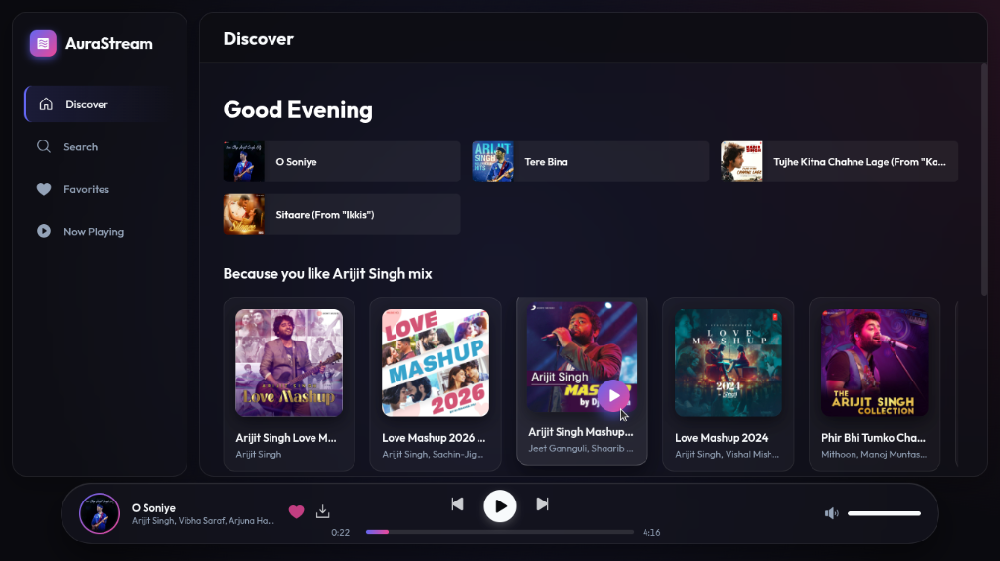
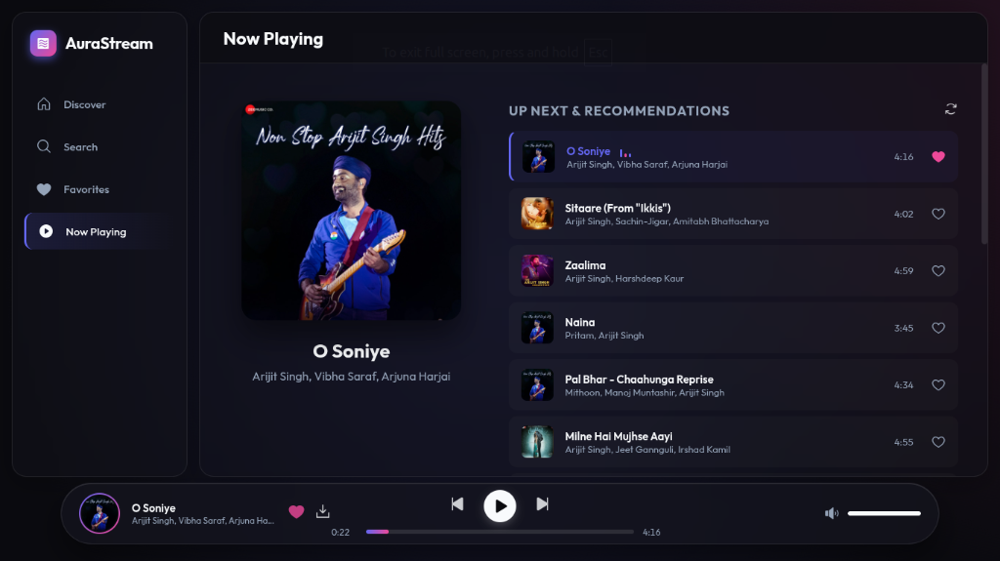
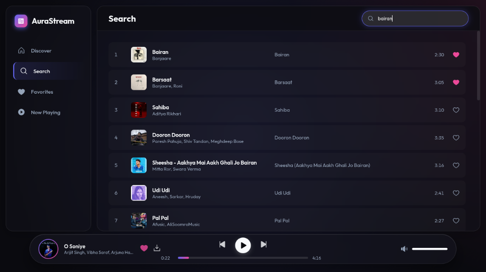
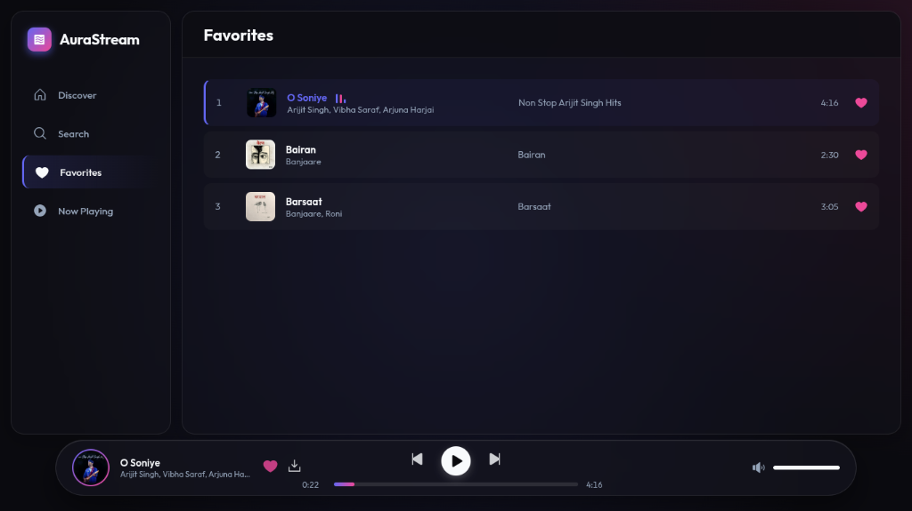

# AuraStream 🎵

AuraStream is a beautiful, modern, and ad-free music streaming web application built with Python and Flask. It uses YouTube as the backend to stream high-quality audio directly to your browser.

<p align="center">
  
  
</p>
<p align="center">
  
  
</p>

## Features ✨
- **Ad-Free Music**: Stream your favorite songs without any interruptions.
- **Beautiful UI**: Modern, glassmorphism-inspired dark mode interface.
- **Lightning Fast**: Built with lightweight Flask and Vanilla JS.
- **Local Streaming**: Run the app locally on your PC/Mac.

## How to Run Locally 🚀

You can easily run this app on your own computer.

### 1. Clone the repository
First, open your terminal or command prompt and run:
```bash
git clone https://github.com/WebsiteLeLo/aurastream.git
cd aurastream
```

### 2. Start the App

#### For Windows:
Simply double-click on the **`run.bat`** file in the folder.
*(Or run `run.bat` from your command prompt)*

#### For Linux/Mac:
Run the setup script from your terminal:
```bash
chmod +x run.sh
./run.sh
```

### 3. Enjoy!
Open your browser and go to: `http://localhost:8000`

## YouTube IP Block Issues (Optional) ⚠️
If you get a "Streaming blocked" or "Bot detected" error even when running locally, it means your IP might be temporarily blocked by YouTube. 
To bypass this:
1. Export your YouTube cookies using a browser extension (like "Get cookies.txt LOCALLY").
2. Save them in a file named `cookies.txt` in the same folder as `app.py`.
3. Restart the server!

## Requirements
- Python 3.8+
- Modern Web Browser
